# Xiaowei XJB EduSaaS Product


## Docker nacos

```bash
# 拉取nacos
docker pull nacos/nacos-server:3.1.1

# 单机模式运行nacos
docker run --name nacos3 -e MODE=standalone -p 8848:8848 -d nacos/nacos-server:3.1.1

# 单机模式运行nacos 
docker run --name nacos3 \
-e MODE=standalone \
-e NACOS_AUTH_IDENTITY_KEY=myNacosKey \
-e NACOS_AUTH_IDENTITY_VALUE=myNacosValue \
-e NACOS_AUTH_TOKEN=SecretKey01234567890123456789012345678901234567890123456789 \
-p 8848:8080 \
-p 9848:9848 \
-p 9849:9849 \
-d nacos/nacos-server:3.1.1

#在浏览器中查看
http://43.228.77.84:8848/index.html


NACOS_AUTH_ENABLE=true

###############################################################
# 拉取nacos1.4.2

docker pull nacos/nacos-server:1.4.2

# 单机模式运行nacos
docker run --name nacos1 \
-e MODE=standalone \
-p 8848:8848 \
-d nacos/nacos-server:1.4.2

#在浏览器中查看
http://43.228.77.84:8848/nacos/
```


查看容器日志

```bash
docker logs -f nacos3
```


在浏览器中查看nacos

访问：`http://43.228.77.84:8848/index.html`

注：确认服务器打开了8848这个端口

```bash
firewall-cmd --zone=public --add-port=8848/tcp --permanent
firewall-cmd --zone=public --add-port=9848/tcp --permanent
firewall-cmd --zone=public --add-port=9849/tcp --permanent

firewall-cmd --reload 

firewall-cmd --zone=public --add-port=3305/tcp --permanent
firewall-cmd --reload 
```


nacos运行界面如图：

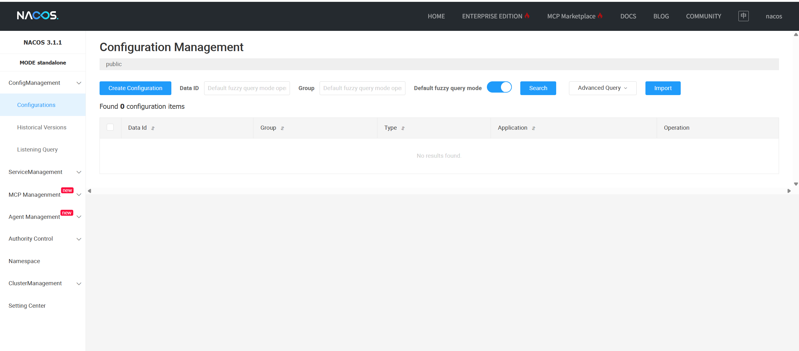


## maven local repositry

### maven download

https://maven.apache.org/download.cgi

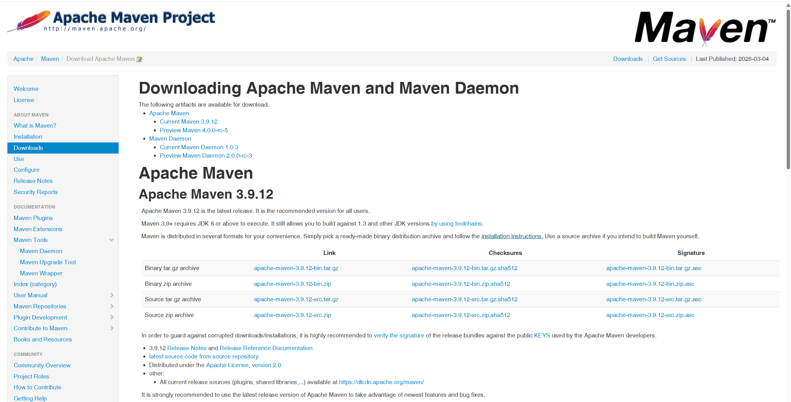


### maven environment variable

Create new user variable MAVEN_HOME = D:\tools\apache-maven-3.9.12（where you put it, it is up you）

Edit Path，Add variable value:  %MAVEN_HOME%\bin

 then  win+R   to run cmd，type in mvn -version，it's successful if it show as following:

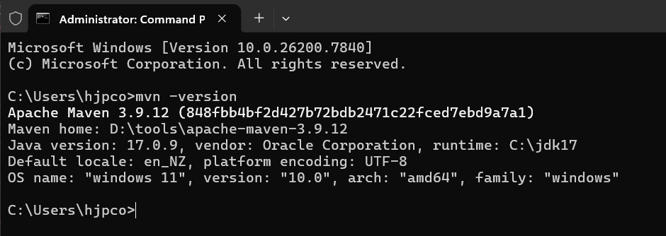


### maven modify config

`D:\tools\apache-maven-3.9.12\conf`, in this path, edit the file named `setting.xml`

add local repositry node:

```xml
<localRepository>D:\tools\MyRepository</localRepository>
```

if you are in China, you maybe need add aliyun maven service server as following:

```xml
<mirror>
    <id>aliyun</id>
    <name>aliyun Maven</name>
    <mirrorOf>*</mirrorOf>
    <url>http://maven.aliyun.com/nexus/content/groups/public/</url>
</mirror>
```


## maven to Intelij IDEA

in Intelij IDEA, open `File/settings` ,then `Build,Execution,Deployment/build Tools/Maven`  set config as following:

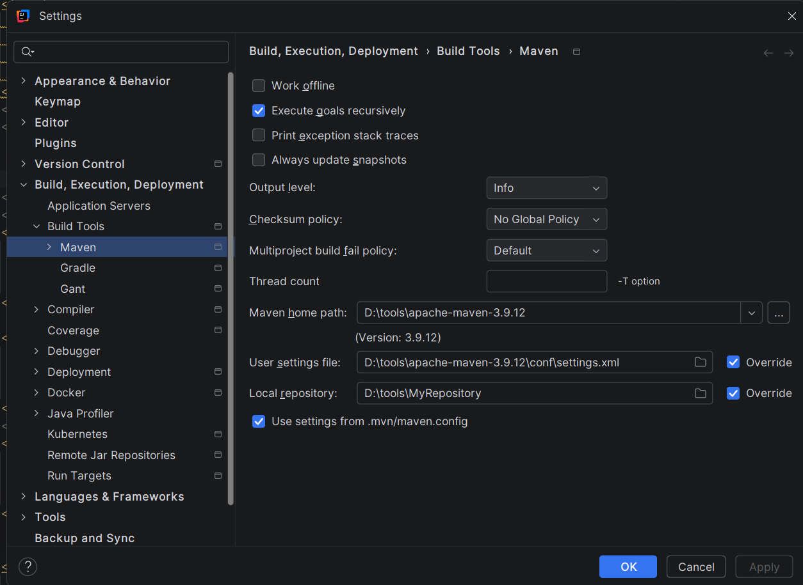


## Recompile project

as following, open the project tagged `root`, you can look Lifecycle, Expand the directory, click `clean`  and then click `compile`, what you did it like that can clean and recompile the whole project.

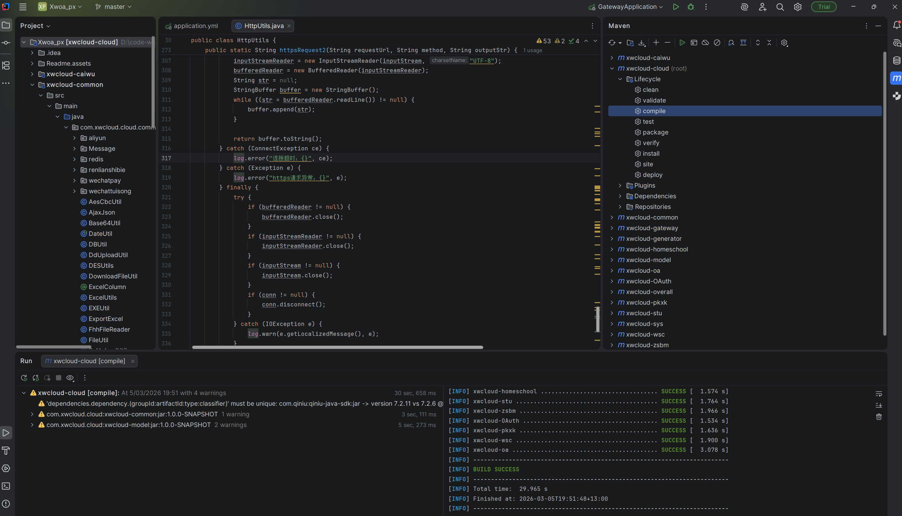


## Start microservice

First run the two microservice with named `gateway`,`auth`， then lunch the microservice named `sys`，then start others microservices.

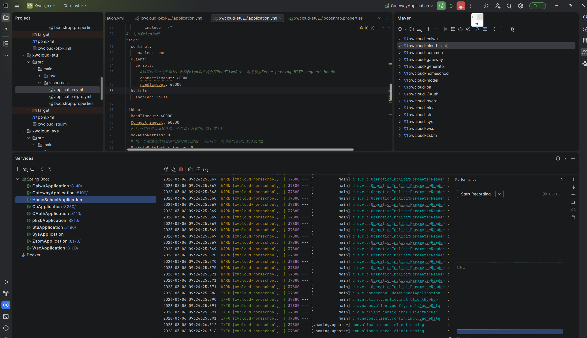


## nacos service list

then you can see all the micro service in nacos service lists. as following:

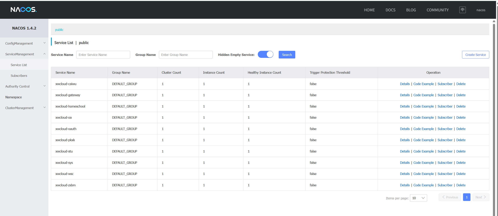


```bash
# swagger showing is innormal. waiting to deal with.

http://43.228.77.84:网关端口/doc.html

http://43.228.77.84:8100/doc.html

http://43.228.77.84:8100/v2/api-docs
```


# function pages

## Enrollment and registration management 招生报名

### Potential customer management 意向学员管理

it included protential customer information management: CRUD, invitation management, follow-up management, trial lesson management,

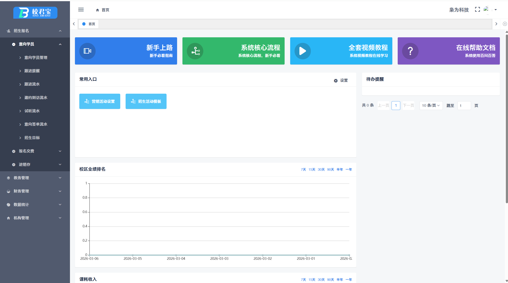


### Registration and Payment 报名缴费

This section primarily focuses on managing student registration and payment. In fact, there are new students making their first payment, as well as existing students renewing their subscriptions. The system can also be pre-configured with certain discount policies, so that when processing student payments, the system can match the available discounts, applicable vouchers, additional products that can be purchased, other customizable service fee items, and payment management based on the student's order.

Students can also pay a deposit first and then the balance later. The system also supports receipt printing

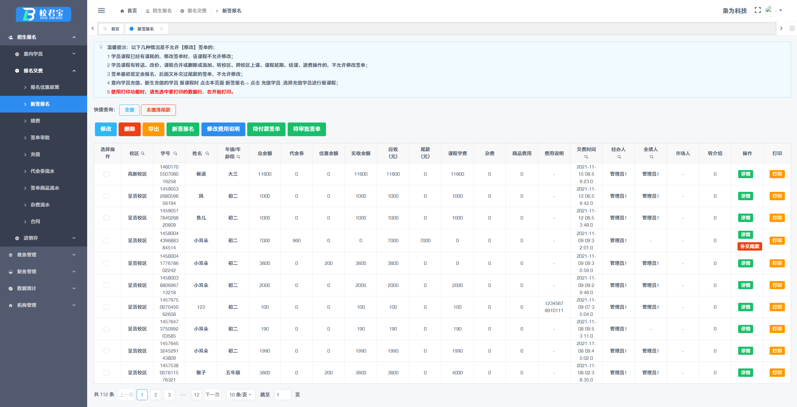


### Inventory management进销存管理

This section is primarily designed for scenarios where training institutions also offer merchandise sales services. It features an online cashier platform where teachers can handle cashiering for merchandise sales, manage merchandise and inventory, oversee merchandise procurement and approval, and view merchandise sales records. Sales statistics are presented in the subsequent data statistics section, which also provides specialized data statistics functions for various categories.

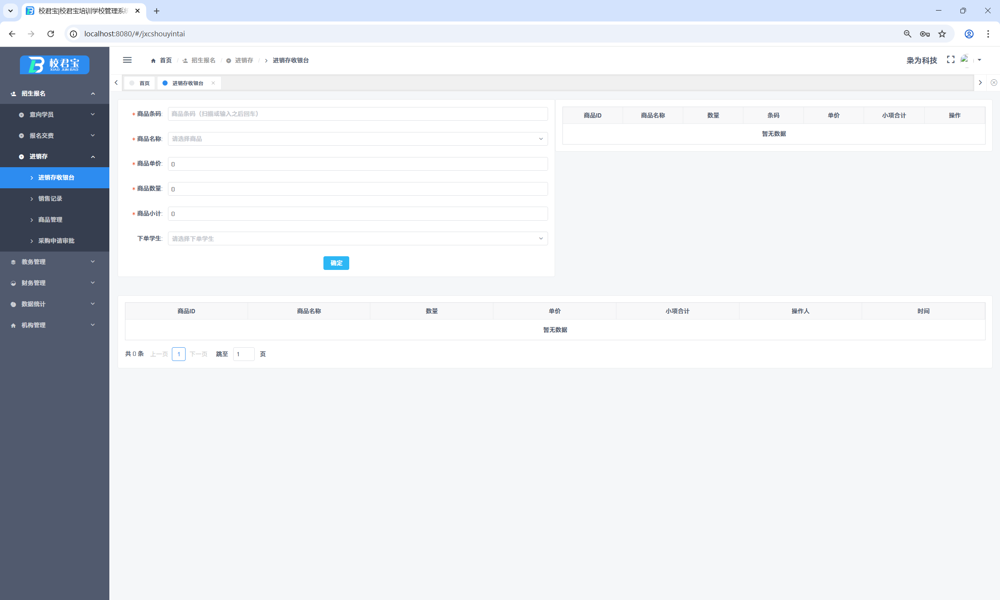


## Educational Administration教务管理

学员管理：学员档案，学员班主任，学员卡，学员积分，学员生日，学员住宿管理

Student management: student profile, student homeroom teacher, student card, student points, student birthday, student accommodation management

学员课程：加课，减课，换课，改价，合并，延期，跨校区上课，课时共享，转送，赠送，成绩管理，考级与证书管理

Student courses: adding classes, reducing classes, changing classes, adjusting prices, merging, postponing, attending classes across campuses, sharing class hours, transferring, giving away, managing grades, managing grading and certificate management

学员班级：插班，转班，退班，班级名单，查询学员班级

Student class: transfer-in, transfer-out, withdrawal, class roster, query student class

排课消课：多种排课模式组合使用，可以单次排课，也可以多次循环排课，可以重复排课，也可以按时间自由选择排课，还可以设置排课的开始日期和结束日期，设置排课是否允许请假，也可以设置最多的请假次数等。系统自动检测排课冲突，多个角色的课表查询与打印和导出，消课与学员签到，考勤流水记录及考勤统计，学员上课记录，教师上课记录，课后评价，可以学员评价老师，也可以老师评价学员

Course scheduling and cancellation: Multiple course scheduling modes can be combined for use, including single scheduling, multiple recurring scheduling, repeat scheduling, free scheduling based on time, as well as setting the start and end dates of scheduling, whether leave is allowed during scheduling, and the maximum number of leave times. The system automatically detects scheduling conflicts, allows for querying, printing, and exporting of multiple roles' schedules, handles course cancellation and student sign-in, maintains attendance records and attendance statistics, tracks student attendance records, teacher attendance records, and post-class evaluations. Students can evaluate teachers, and teachers can evaluate students

家校互动：微信群发，微信请假，微信作业，约课，学员回访，电子相册，满意度评价，学员反馈，图书借阅，家长微公告，学员微信账号管理

Home-school interaction: WeChat group messaging, WeChat leave requests, WeChat homework assignments, lesson scheduling, student follow-ups, electronic photo albums, satisfaction evaluations, student feedback, book lending, parent micro-announcements, student WeChat account management

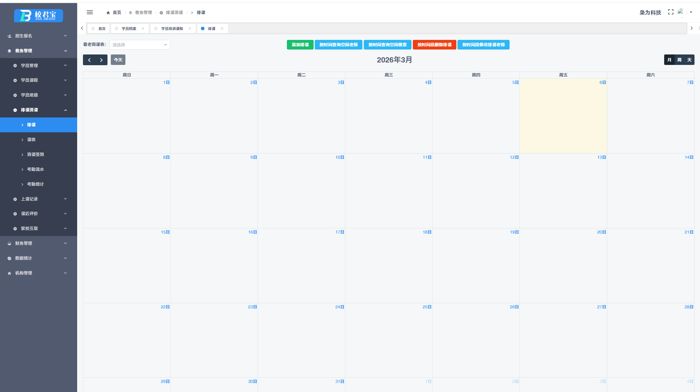


## Financial Management财务管理

退费审批管理，工资管理，各类费用统计，财务流水，盈亏统计

Refund approval management, salary management, various expense statistics, financial transactions, profit and loss statistics

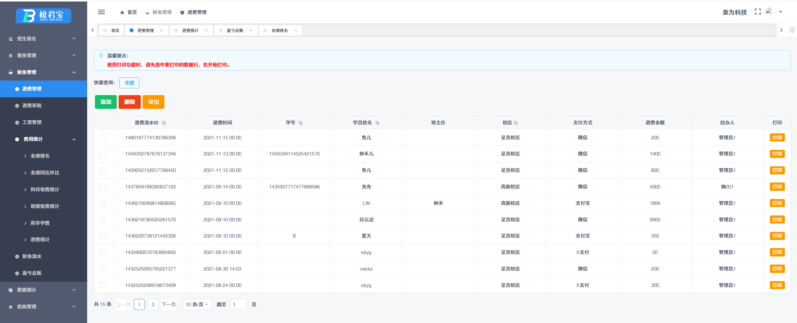


## data statistics数据统计

招生统计：招生途径分析，意向签单统计，学生来源统计，学生来源学校，学生来源教师，学员流失率，续费率

Enrollment statistics: analysis of enrollment channels, statistics of intention to sign up, statistics of student sources, student source schools, student source teachers, student turnover rate, renewal rate


课耗统计：科目课耗统计，班级课耗统计，教师课耗统计，班主任课耗统计，月均课耗统计，课耗收入同比环比

Classtime consumption statistics: subject class consumption statistics, class classtime consumption statistics, teacher classtime consumption statistics, class-teacher classtime consumption statistics, monthly average classtime consumption statistics, year-on-year and month-on-month comparison of classtime consumption income


人数统计：学生人数统计，教师学员统计，班主任学员统计

Number statistics: student number statistics, teacher-student number statistics, and class teacher-student number statistics


其他统计：科目占比统计，长期停课学员，排课统计，班课收益查询，科目财务统计，科目报名统计
Other statistics: subject proportion statistics, long-term suspended students, scheduling statistics, class revenue inquiry, subject financial statistics, subject enrollment statistics

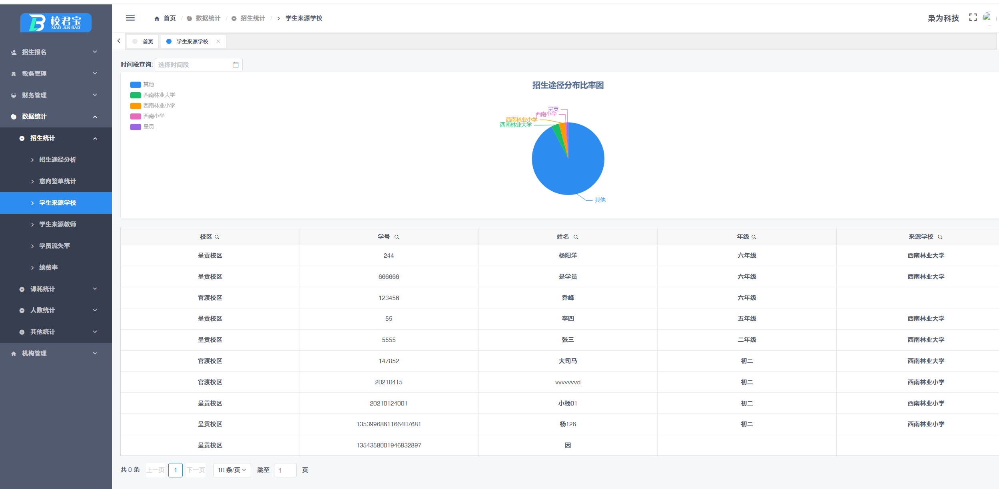


## Institutional Management机构管理

系统设置：机构设置，学员设置，教务设置，财务设置，微信设置，打印设置

System settings: institution settings, student settings, academic settings, financial settings, WeChat settings, print settings


员工管理：员工账号管理，员工微信群发，工作日报，周工作总结，员工异常考勤

Employee management: employee account management, employee WeChat group messaging, daily work reports, weekly work summaries, and abnormal employee attendance


固定资产管理，系统日志，消息管理

Fixed asset management, system logs, and message management

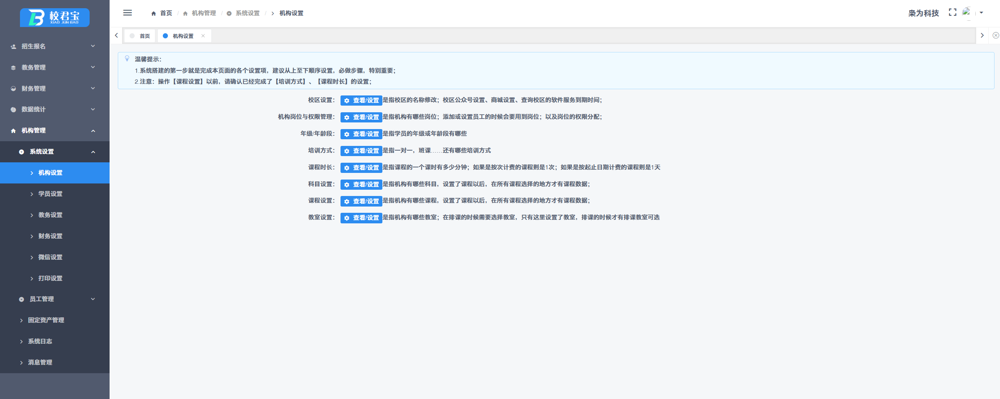


